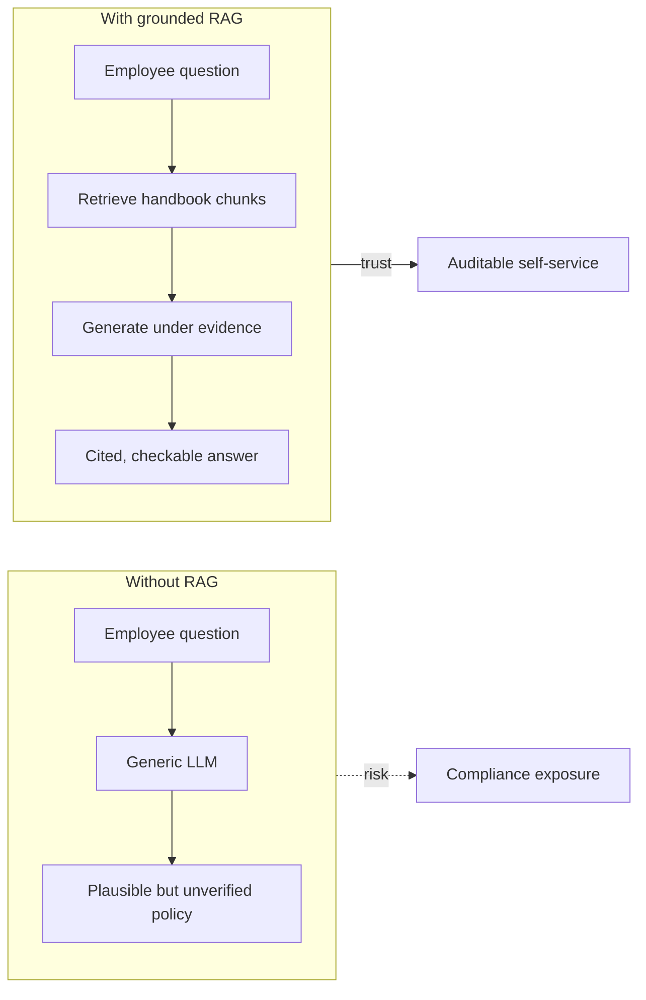
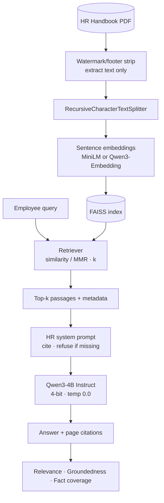
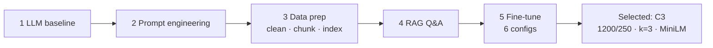
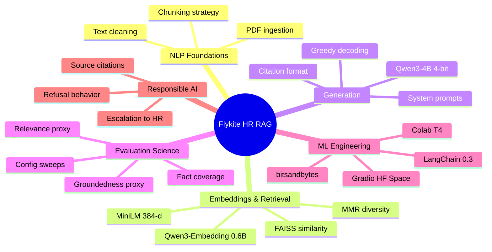

<!--
  Flykite Airlines — HR Policy Q&A Bot (RAG Capstone)
  Author: Sourojit Dhua
-->

 

  

  

**End-to-end HR policy assistant for Flykite Airlines — LLM baseline → prompt engineering → RAG → tuned RAG — built and documented by [Sourojit Dhua](https://github.com/sourojitd).**

 

  

[**Live showcase**](https://sourojitd.github.io/AIML-Flykite-HR-RAG/) · [HF demo](https://huggingface.co/spaces/sourojitd/airline-hr-policy-bot) · [Architecture](#-system-architecture) · [Results](#-evaluation--results) · [Topics](#-topics--skills-demonstrated) · [Artifacts](#-repository-contents)

---

## Overview

Flykite Airlines’ HR policies live in a dense, 14-page handbook. Employees struggle to find answers; HR absorbs repetitive tickets. A bare LLM sounds fluent — and can invent company policy.

This project builds a **Retrieval-Augmented Generation (RAG)** prototype that answers employee questions in plain language, **constrained by retrieved handbook evidence**, with **page/section citations** for auditability.

Four methods were evaluated on the same three benchmark questions using deterministic metrics (relevance, groundedness proxy, fact coverage):

| Method | What changes | Takeaway |
|---|---|---|
| **1 — LLM only** | No handbook | Fluent, weakly grounded — compliance risk |
| **2 — Prompt engineering** | Safety-first prompt, still no retrieval | Safer refusals; cannot invent Flykite facts |
| **4 — RAG** | FAISS retrieval + grounded prompt | Breakthrough on fact coverage + citations |
| **5 — Tuned RAG** | 6-config hyperparameter sweep | Best: **`C3-large+fewer`** (combined **0.734**) |

> Capstone work in **NLP + RAG** by **Sourojit Dhua**. Notebook runs open models on Colab T4 (4-bit); the hosted demo uses Groq LLaMA 3.3 70B behind Gradio.

---

## Why it matters

- **HR load** — deflect routine leave / probation / conduct queries
- **Employee clarity** — natural-language answers instead of PDF archaeology
- **Compliance** — citations make every answer reviewable; “I don’t know” beats a confident wrong policy

---

## System architecture

**Hosted demo path** (HF Space): same retrieval idea with `all-MiniLM-L6-v2` + FAISS + **Groq `llama-3.3-70b-versatile`** for low-latency chat.

---

## Method ladder

---

## Evaluation & results

Metrics (0–1, higher better), scored on answer text with citations stripped:

| Metric | Business question | Signal |
|---|---|---|
| **Relevance** | Does it address the ask? | Answer ↔ question embedding cosine |
| **Groundedness** | Supported by handbook? | Answer ↔ top handbook passages (proxy) |
| **Fact coverage** | Key policy facts stated? | Keyword checklist per question |

**Headline averages**

| Method | Relevance | Groundedness | Fact coverage |
|---|:---:|:---:|:---:|
| LLM only | 0.765 | 0.489 | 0.244 |
| LLM + prompt eng. | 0.505 | 0.597 | 0.122 |
| RAG (default) | 0.713 | 0.608 | 0.811 |
| **Tuned RAG — C3** | 0.688 | **0.669** | **0.867** |

**Fine-tuning leaderboard (combined = 0.30·rel + 0.40·gnd + 0.30·fact)**

| Config | Setting | Combined |
|---|---|:---:|
| **C3** | 1200/250; k=3; similarity; MiniLM | **0.734** |
| C5 | 800/150; k=4; similarity; Qwen3-0.6B | 0.705 |
| C1 | 800/150; k=4; similarity; MiniLM | 0.700 |
| C2 | 500/100; k=6; similarity; MiniLM | 0.688 |
| C6 | 600/120; k=6; similarity; Qwen3-0.6B | 0.686 |
| C4 | 800/150; k=5; MMR; MiniLM | 0.649 |

Benchmark questions: probation benefits, bereavement leave, harassment reporting. With only three scored queries, C3 is the **selected prototype config**, not a universal optimum.

---

## Topics & skills demonstrated

<strong>Expand: topic depth (what reviewers should notice)</strong>

| Topic | Where it shows up |
|---|---|
| **LLM-only failure modes** | Baseline invents company-agnostic benefits policy (Q1 fact coverage 0.000) |
| **Prompt engineering as safety layer** | Knowledge-boundary prompts raise groundedness without adding facts |
| **Corpus hygiene** | Repeating watermark/footer stripped from *extracted text* only; source PDF untouched |
| **Chunking trade-offs** | Larger chunks + smaller `k` (C3) beat default and MMR on this handbook |
| **Embedding model A/B** | MiniLM vs Qwen3-Embedding-0.6B under matched generation |
| **Retriever design** | Similarity vs MMR; `k` ∈ {3,4,5,6} |
| **Grounded generation** | Context-injected HR prompt; cite handbook/section/page/clause |
| **Deterministic eval** | No judge API — embedding proxies + keyword fact lists; caveats documented |
| **Quantized local inference** | `bitsandbytes` nf4 4-bit Qwen3-4B on T4; `temperature=0` |
| **Productization** | Gradio chat on Hugging Face Spaces (Groq backend) for public demo |
| **Business translation** | Pilot recommendations, escalation rules, compliance framing |

---

## Stack

| Layer | Choice |
|---|---|
| LLM (research notebook) | `Qwen/Qwen3-4B-Instruct-2507` · Apache-2.0 · 4-bit |
| LLM (HF demo) | Groq `llama-3.3-70b-versatile` |
| Embeddings | `sentence-transformers/all-MiniLM-L6-v2` · trial `Qwen/Qwen3-Embedding-0.6B` |
| Vector store | FAISS (CPU) |
| Orchestration | LangChain 0.3 |
| UI (demo) | Gradio on Hugging Face Spaces |
| Runtime (notebook) | Google Colab · T4 GPU |

---

## Repository contents

| Path | Description |
|---|---|
| [`Flykite_HR_RAG_Capstone.ipynb`](Flykite_HR_RAG_Capstone.ipynb) | End-to-end graded notebook (methods 1→5, eval, insights) |
| [`Sourojit_FlykiteHRPolicyQnA_Notebook.html`](Sourojit_FlykiteHRPolicyQnA_Notebook.html) | Fully executed notebook export |
| [`Sourojit_FlykiteHRPolicyQnA_FinalReport.pdf`](Sourojit_FlykiteHRPolicyQnA_FinalReport.pdf) | Business report with methodology, tables, recommendations |
| [`docs/`](docs/) | Interactive GitHub Pages showcase |
| [HF Space](https://huggingface.co/spaces/sourojitd/airline-hr-policy-bot) | Live Gradio HR assistant |

The Flykite Airlines HR handbook PDF (dataset booklet) could not be uploaded here as it is copyrighted. The research notebook expects that file in the Colab environment when re-running experiments.

---

## How to explore

1. **Interactive site** — [sourojitd.github.io/AIML-Flykite-HR-RAG](https://sourojitd.github.io/AIML-Flykite-HR-RAG/)
2. **Live bot** — [Hugging Face Space](https://huggingface.co/spaces/sourojitd/airline-hr-policy-bot)
3. **Read the report** — open the PDF for business narrative and full tables
4. **Reproduce experiments** — open the `.ipynb` in Google Colab (T4 GPU), attach the handbook PDF privately, *Runtime → Run all*

No API keys are required for the graded notebook models (ungated HF weights). Do not commit tokens or the copyrighted handbook into this repository.

---

## Author

**Sourojit Dhua** · [GitHub](https://github.com/sourojitd) · [Hugging Face](https://huggingface.co/sourojitd)

Built as a portfolio-ready NLP / RAG capstone: retrieval science, evaluation discipline, and compliance-aware GenAI product thinking.

---

*Grounded answers. Cited policy. Fewer tickets.*

